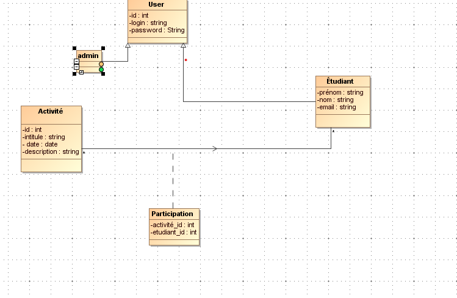
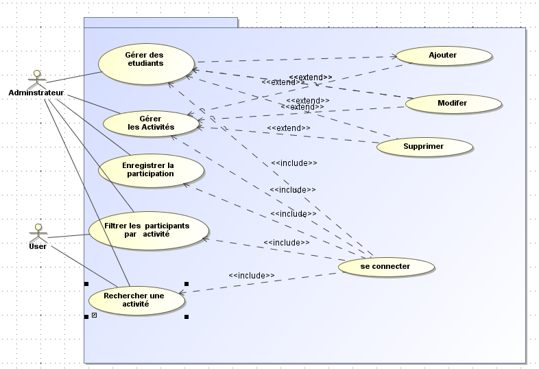

# Gestion des Activités Pédagogiques

## Description
La gestion des activités pédagogiques permet d'organiser et de suivre les différentes activités proposées aux étudiants. Cela comprend la création d'activités, l'enregistrement des participations des étudiants, et la capacité de filtrer et de rechercher des activités spécifiques. Ce système vise à améliorer l'engagement des étudiants et à faciliter l'organisation des événements académiques.

## Objectifs
- **Organiser les Activités** : Faciliter la planification et la gestion des activités pédagogiques.
- **Suivre la Participation** : Enregistrer et analyser la participation des étudiants à chaque activité pour en évaluer l'impact et l'intérêt.
- **Améliorer l'Engagement** : Encourager les étudiants à participer aux activités proposées, favorisant ainsi leur apprentissage et leur développement personnel.
- **Fournir des Statistiques** : Offrir des données sur la participation pour aider à la prise de décision concernant les futures activités.

## Tables
### Activité
- **id** : Identifiant unique de l'activité (INT)
- **intitule** : Titre de l'activité (VARCHAR)
- **date** : Date de l'activité (DATE)
- **description** : Description de l'activité (TEXT)

### Étudiant
- **id** : Identifiant unique de l'étudiant (INT)
- **nom** : Nom de l'étudiant (VARCHAR)
- **prénom** : Prénom de l'étudiant (VARCHAR)
- **email** : Adresse email de l'étudiant (VARCHAR)

### ParticipationActivité
- **activité_id** : Référence à l'activité à laquelle l'étudiant participe (INT)
- **étudiant_id** : Référence à l'étudiant participant (INT)

## Fonctionnalités
- **Ajouter une Activité** : Permet aux administrateurs ou aux enseignants de créer une nouvelle activité en spécifiant son intitulé, sa date, et une description.
- **Enregistrer la Participation** : Permet aux étudiants de s'inscrire à des activités en les associant à leur identifiant.
- **Filtrer les Participants par Activité** : Permet d'afficher la liste des étudiants inscrits à une activité spécifique.
- **Rechercher une Activité** : Fonctionnalité permettant de trouver une activité par son intitulé ou sa date.

## Diagrammes
- **Diagramme de Classe** : 

- **Diagramme d’Utilisation** : 

## Codes SQL
Voici les requêtes SQL pour créer les tables et insérer des données :

```sql
-- Création de la table Activité
CREATE TABLE Activité (
    id INT AUTO_INCREMENT PRIMARY KEY,
    intitule VARCHAR(255) NOT NULL,
    date DATE NOT NULL,
    description TEXT
);

-- Création de la table Étudiant
CREATE TABLE Étudiant (
    id INT AUTO_INCREMENT PRIMARY KEY,
    nom VARCHAR(100) NOT NULL,
    prénom VARCHAR(100) NOT NULL,
    email VARCHAR(255) NOT NULL UNIQUE
);

-- Création de la table ParticipationActivité
CREATE TABLE ParticipationActivité (
    activité_id INT NOT NULL,
    etudiant_id INT NOT NULL,
    FOREIGN KEY (activité_id) REFERENCES Activité(id) ON DELETE CASCADE,
    FOREIGN KEY (etudiant_id) REFERENCES Étudiant(id) ON DELETE CASCADE
);